# CI/CD com Jenkins e Kubernetes

Uma configuração de fluxo de CI/CD com Jenkins e Kubernetes.

## Considerações

Estou utilizando um cluster no Kubernetes Engine do Google Cloud Plataform e Github. Optei pelo Google pois ele não cobra pelo gerenciamento do Kubernetes, apenas os nós utilizados, assim como a Azure, além de oferecer 300 dólares para utilizar por um ano (~ R$990,00). Porém, a única coisa que deve diferir entre as plataformas são os passos de autenticação.

Uma das vantagens de utilizar Jenkins e Kubernetes é que os builds do projeto podem ser realizados em pods do Kubernetes, se comunicando por um tunel tcp, isso faz com que o fluxo de entrega contínua seja escalável e gerenciado pelo Kubernetes.

### Plugins

Certifique-se que os plugins "Google Oauth" e "Kubernetes" estão instalados.

### Adicionando as credenciais

Clique em:

* Credentials -> System -> Global credentials -> Add Credentials.

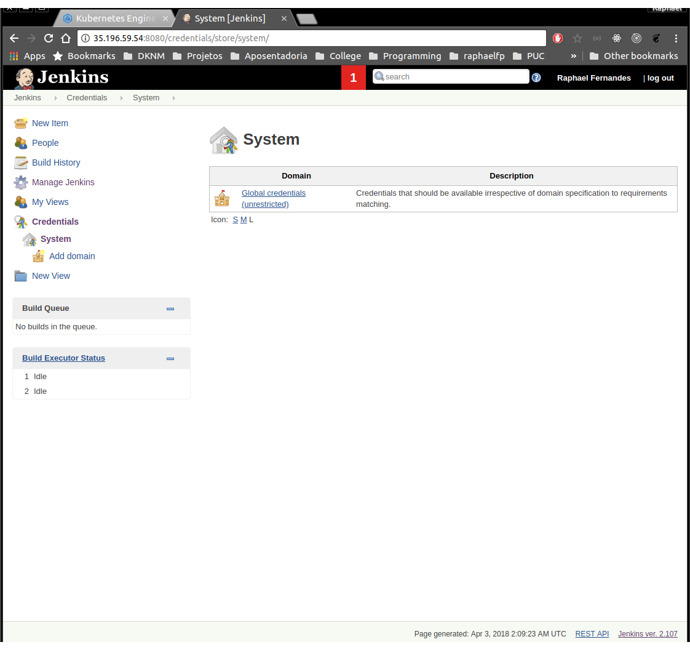

* Preencha os dados abaixo e clique em OK.
  * Kind: Google Service Account from metadata;
  * Project Name: O nome do projeto que você criou no GCP;

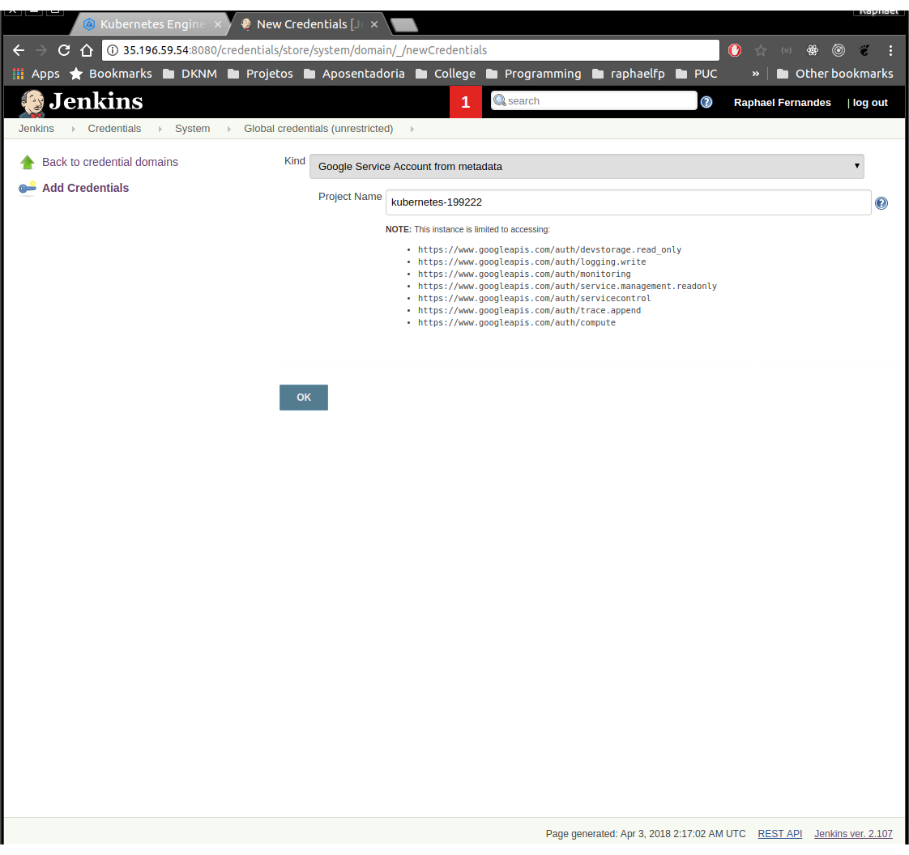

* Clique novamente em Add Credentials e preencha os dados abaixo:

  * Kind: Kubernetes Service Account;
  * Scope: Deixe como está;

* Logue no console do GCP e pegue suas credenciais.
  Kubernetes Engine -> Kubernetes Cluster -> o cluster desejado -> Show credentials

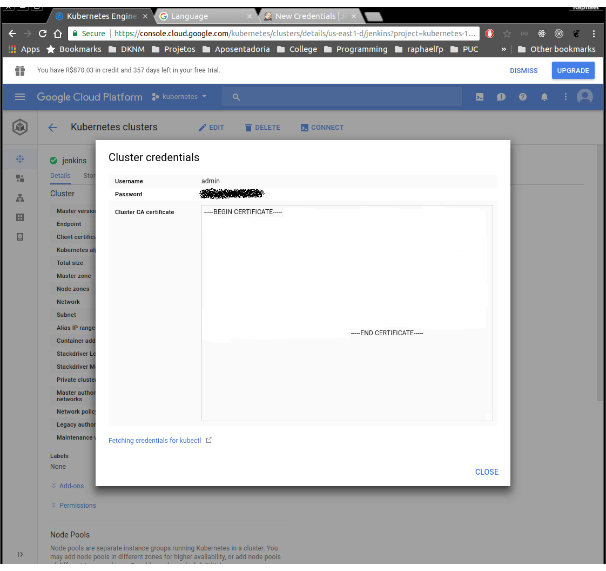

* Clique novamente em Add Credentials e preencha suas credenciais.
  * Kind: Username with password;
  * Username: Seu username (admin por padrão no GCP);
  * Password: A senha do GCP (vide imagem abaixo);

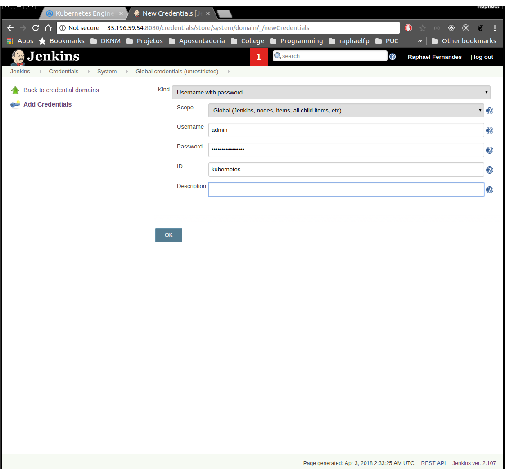

### Configurações do sistema

Clique em Manage Jenkins -> Configure System

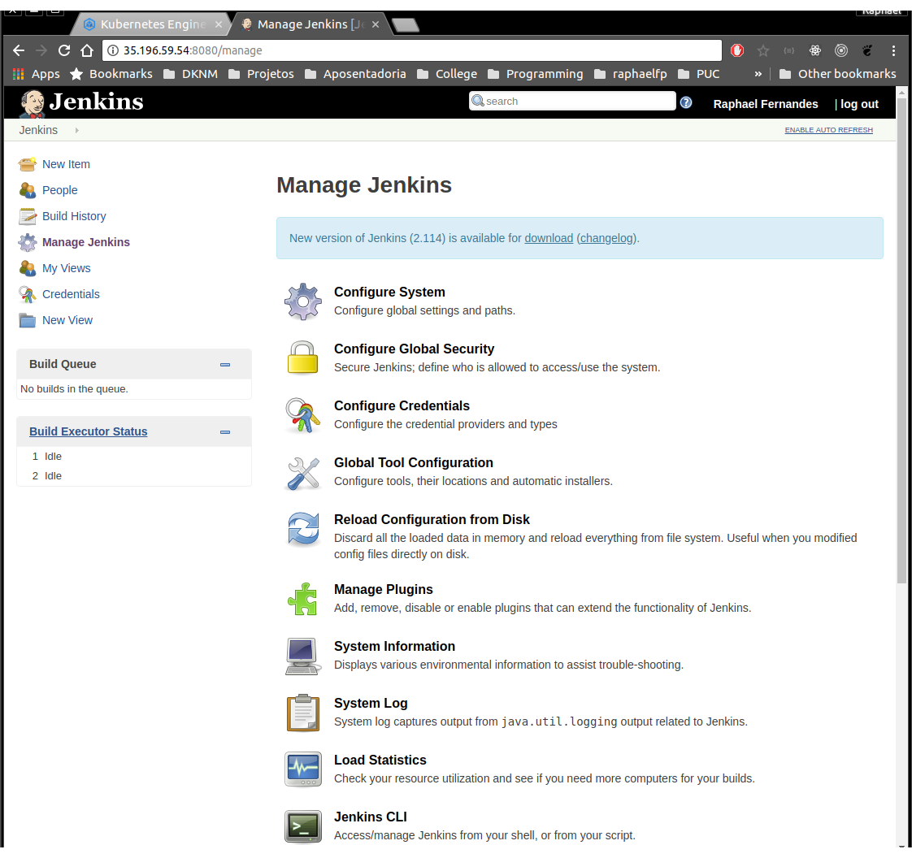

Nessa tela configure as seguintes opções:

* \# of executors: 0
  * Isso faz com que o Jenkins não use de seus agentes padrões para gerar os builds, forçando o sistema a utilizar agentes externos (Kubernetes).

No fim da tela clique em Add new cloud -> Kubernetes e preencha os seguintes campos:

* Kubernetes URL: https://kubernetes.default;
  * Considerando que o pod do Jenkins está publicado dentro do cluster onde iremos utilizar os agentes, podemos utilizar o DNS do próprio Kubernetes. Se os agentes forem rodar em um cluster externo, execute o comando "kubectl cluster-info" para obter o endereço do "kubernetes master.
* Marque a opção "Disable https certificate check";
* Kubernetes Namespace: O namespace onde seus agentes irão rodar;
* Credentials: As credenciais (usuário e senha) que foram obtidas na plataforma do GCP;
* Jenkins URL: http://jenkins-ui.jenkins.svc.cluster.local:8080;
  * Endpoint da UI do Jenkins. Novamente podemos utilizar o DNS do Kubernetes. Nota-se que meu Jenkins foi publicado no namespace Jenkins;
* Jenkins tunnel: jenkins-discovery.jenkins.svc.cluster.local:50000;
  * Também utilizando o DNS do Kubernetes. Nota-se que NÃO estamos especificando o protocolo no caminho, apenas o endpoint e a porta.

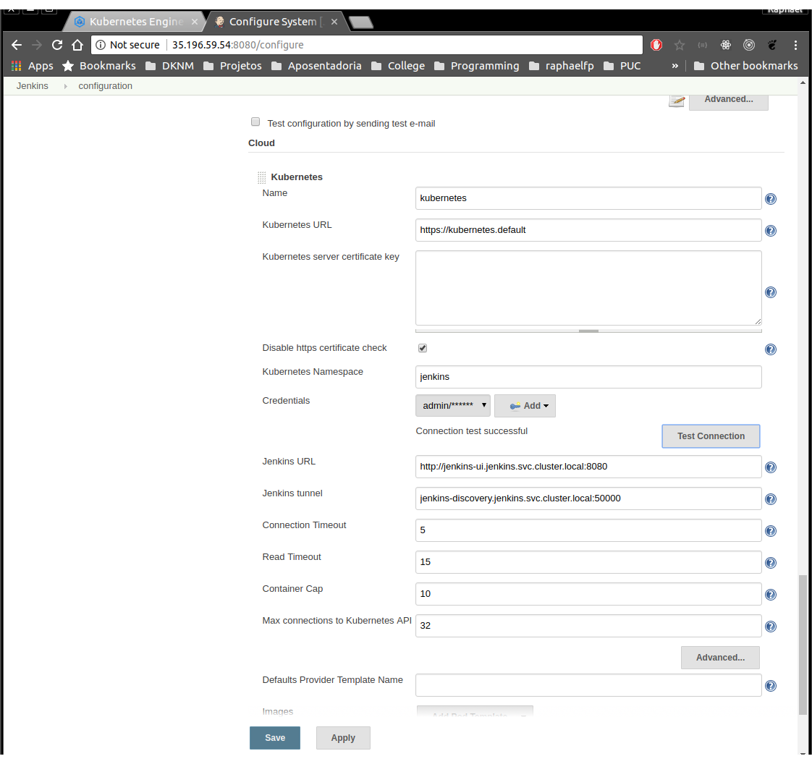

A criação de um template do pod é opcional, caso não seja especificado o plugin irá utilizar a imagem jenkins/jnlp-slave por padrão.

### Pipeline do Jenkins

Vamos criar um novo projeto do Jenkins. Clique em "create new jobs".

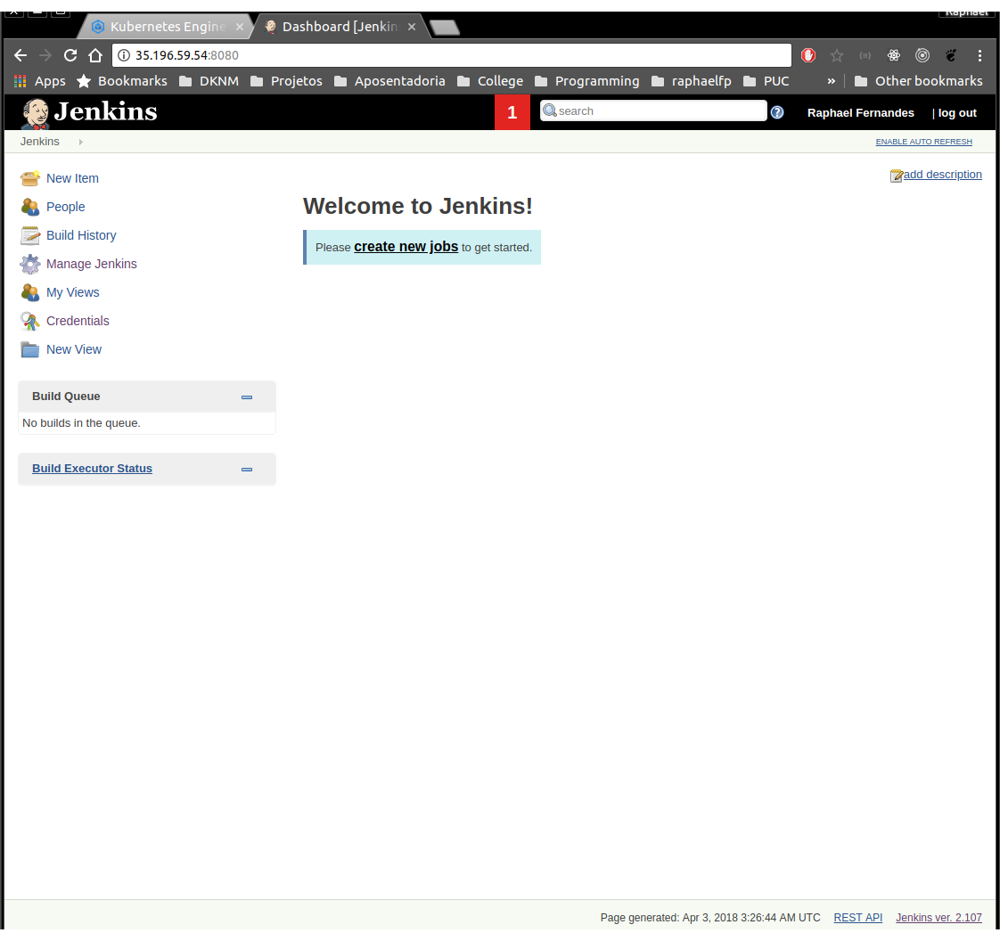

Entre com o nome do pipeline, selecione a opção "Pipeline" e clique em OK.

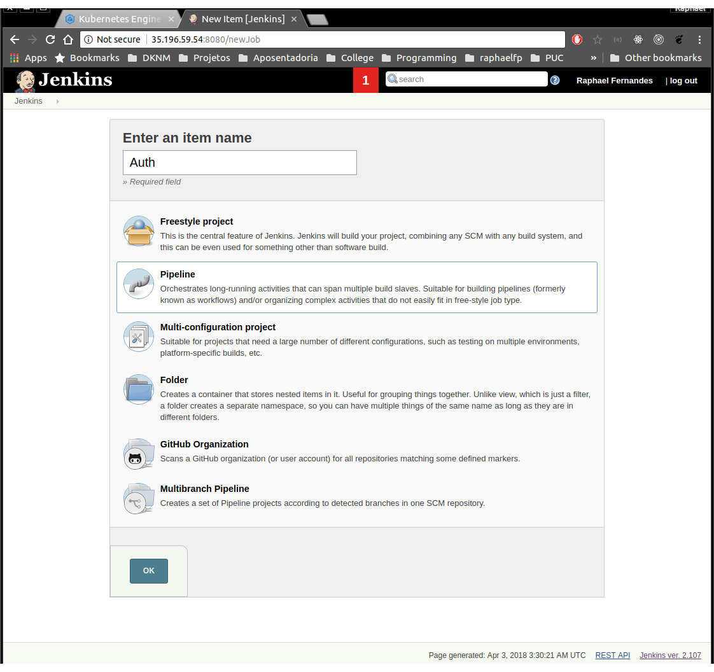

Marque a opção "Github project" e coloque a URL de seu projeto. Em "Build Triggers" marque a opção "GitHub hook trigger for GITScm polling", isso faz com que o Github notifique o Webhook do Jenkins que um novo commit foi publicado (também funciona com tags, pull requests e afins, apenas mude o campo "Refspec" do repositório).

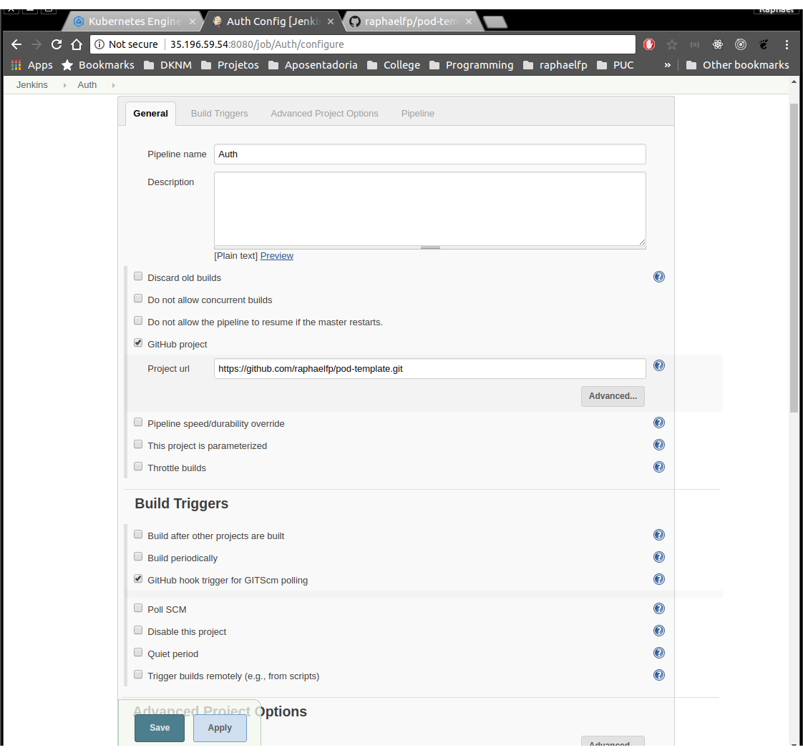

Em "Pipeline" preencha os seguintes campos:

* Definition: Pipeline script from SCM;
  * Iremos utilizar um Jenkinsfile contido no repositório da aplicação.
* SCM: Git;
* Repository URL: caminho do seu repositório;
* Credentials: Suas credenciais caso o repositório não seja público;
* Branch Specifier (blank for 'any'): _/_
  * Isso irá fazer com que o build seja gerado com um push em qualquer branch do repositório.

Clique em save.

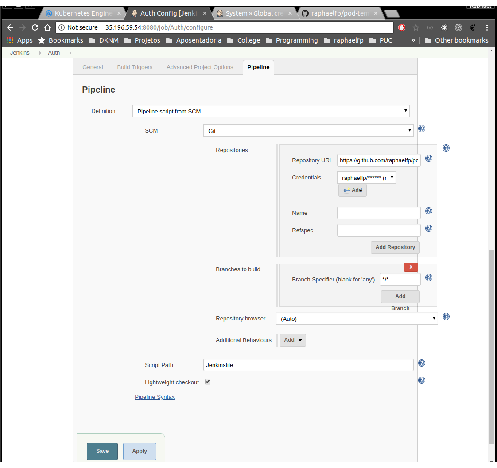

### Jenkinsfile

O pipeline que estou utilizando é bem simples, apenas para dar uma ideia de como o fluxo de CI/CD pode ser implementado. O Jenkinsfile precisa estar na raiz do projeto e utiliza a linguagem Groovy, podendo ser declarativo ou script. Particularmente acho o script menos verboso:

```groovy
//Jenkinsfile (Declarative Pipeline)
pipeline {
    agent any
    stages {
        stage('Build') {
            steps {
                //
            }
        }
        stage('Test') {
            steps {
                //
            }
        }
        stage('Deploy') {
            steps {
                //
            }
        }
    }
}
```

```groovy
//Jenkinsfile (Scripted Pipeline)
node {  
    stage('Build') {
        //
    }
    stage('Test') {
        //
    }
    stage('Deploy') {
        //
    }
}
```

### Exemplo de Pipeline

Segue o exemplo comentado.

```groovy
//Label do pod que será gerado para gerar o build
def label = "jenkins-agent-${UUID.randomUUID().toString()}"

//Nas versões mais novas do plugin do Kubernetes é possível especificar o template
//do pod no próprio Jenkinsfile. Isso facilita a IaC e reutilização do fluxo de publicação
podTemplate(label: label, cloud: 'kubernetes-199222', namespace:'jenkins', containers: [
    //Aqui estou definindo um template de uma imagem docker onde irei executar os comandos
    //do docker. Idealmente você pode criar uma imagem para os seus projetos e referenciá-la aqui
    containerTemplate(name: 'docker', image: 'docker', command: 'cat', ttyEnabled: true),
    //Imagem (que eu criei e publiquei no Docker Hub) que possui o Kubectl instalado
    //Eu poderia ter apenas uma imagem com Docker e Kubectl, apenas quis demonstrar o uso
    //de múltiplos containers.
    containerTemplate(name: 'kubectl', image: 'raphaelfp/jnlp-slave:lts', command: 'cat', ttyEnabled: true)
],
volumes: [
    //Estou mapeando os volumes do Docker para poder utilizá-lo
    hostPathVolume(mountPath: '/usr/bin/docker', hostPath: '/usr/bin/docker'),
    hostPathVolume(mountPath: '/var/run/docker.sock', hostPath: '/var/run/docker.sock')
]) {
    //Estou instruindo esse "nó" do pipeline para utilizar o template definido acima
    node(label) {
        //Fazendo checkout no Github e armazendo o Branch e Commit em variáveis
        def myRepo = checkout scm
        def gitCommit = myRepo.GIT_COMMIT
        //Não tratei o nullpointer pois quero que o build pare se ele não conseguir
        //obter o nome do branch
        def gitBranch = myRepo.GIT_BRANCH.replace("origin/","")

        //Variáveis do meu projeto
        def project = 'raphaelfp'
        def appName = 'auth'
        def svcPort = 3000

        //Nome da imagem gerada. Será algo como raphaelfp/auth:master.18
        def imageName = "${project}/${appName}:${gitBranch}.${env.BUILD_NUMBER}"


        //Primeiro estágio, cria um build da minha imagem. Vide Dockerfile
        //Detalhe que iremos utilizar o container do Docker criado no template
        //para os estágios abaixo
        stage('Build image') {
            container('docker') {
                echo "Building docker image \"${imageName}\""
                sh "docker build -t ${imageName} ."
            }
        }

        //Executa os testes na imagem do Docker criada
        stage('Test build') {
            container('docker') {
                echo "Testing image \"${imageName}\""
                sh "docker run ${imageName} npm test"
            }
        }

        //Publica a imagem no Docker Hub. A variável DOCKER_HUB_PASS é uma variável
        //de ambiente que pode ser setada em Manage Jenkins -> Configure System -> Environment variables
        stage('Push image to registry') {
            container('docker') {
                echo "Testing image \"${imageName}\""
                sh "docker login -u raphaelfp -p ${DOCKER_HUB_PASS}"
                sh "docker push ${imageName}"
            }
        }

        //Idealmente utilizaríamos algo como Helm para gerenciar e dar patch nas imagens
        //do Kubernetes, mas for the sake of simplicity estou utilizando o seed (comando bash) e apply
        stage('Deploy application') {
            //Mudamos para o container que contém o kubectl
            container('kubectl') {
                echo "Deploying application"
                //Se comporta de maneira diferente de acordo com o Branch
                switch (gitBranch) {
                    case "staging":
                        //Altera o nome da imagem padrão para o nome da imagem do build
                        //ex.: raphaelfp/auth -> raphaelfp/autn:master.18
                        sh("sed -i.bak 's#${project}/${appName}#${imageName}#' k8s/staging/")
                        //Publica o serviço no namespace correspondente ao branch
                        sh("kubectl --namespace=staging apply -f k8s/services/")
                        //Publica o pod no namespace correspondente ao branch
                        sh("kubectl --namespace=staging apply -f k8s/staging/")
                        //Cospe a URL do LoadBalancer. Pode retornar null na primeira vez
                        //caso o LoadBalancer ainda não exista, mas isso não atrapalha o fluxo
                        sh("echo http://`kubectl --namespace=production get service/${appName} --output=json | jq -r '.status.loadBalancer.ingress[0].ip'`:${svcPort} > ${appName}")
                        break

                    //Segue os mesmos passos para o master
                    case "master":
                        sh("sed -i.bak 's#${project}/${appName}#${imageName}#' k8s/production/")
                        sh("kubectl --namespace=production apply -f k8s/services/")
                        sh("kubectl --namespace=production apply -f k8s/production/")
                        sh("echo http://`kubectl --namespace=production get service/${appName} --output=json | jq -r '.status.loadBalancer.ingress[0].ip'`:${svcPort} > ${appName}")
                        break

                    //Segue os mesmos passos para qualquer outro branch
                    default:
                        sh("kubectl get ns ${gitBranch} || kubectl create ns ${gitBranch}")
                        sh("sed -i.bak 's#${project}/${appName}#${imageName}#' k8s/dev/")
                        sh("kubectl --namespace=${gitBranch} apply -f k8s/services/")
                        sh("kubectl --namespace=${gitBranch} apply -f k8s/dev/")
                        sh("echo http://`kubectl --namespace=${gitBranch} get service/${appName} --output=json | jq -r '.status.loadBalancer.ingress[0].ip'`:${svcPort} > ${appName}")
                }
            }
        }
    }
}
```

### Webhook do Github

Configure o Webhook no Github. Para quem quiser saber mais sobre [Webhooks](https://developer.github.com/webhooks/).

Settings -> Integrations & services -> Add service -> Jenkins (Git plugin):

* Em Jenkins url coloque a URL da UI do Jenkins /github-webhook/
  Ex.: http://127.0.0.1:8080/github-webhook/

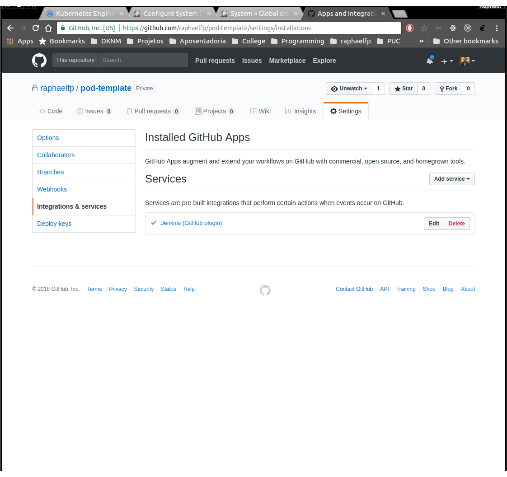

### Teste

Publique um commit para o repositório, monitore os pods sendo criados e reze para o <span style="color:yellow">&#x2600;</span> (solzinho) aparecer no Jenkins <span style="color:blue">👍</span>.
